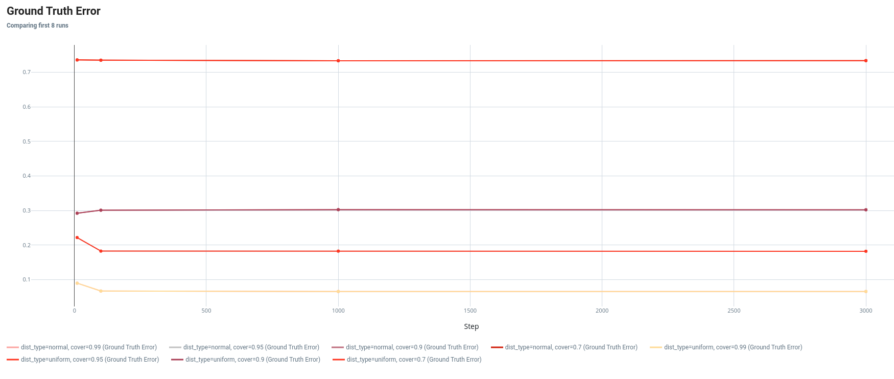
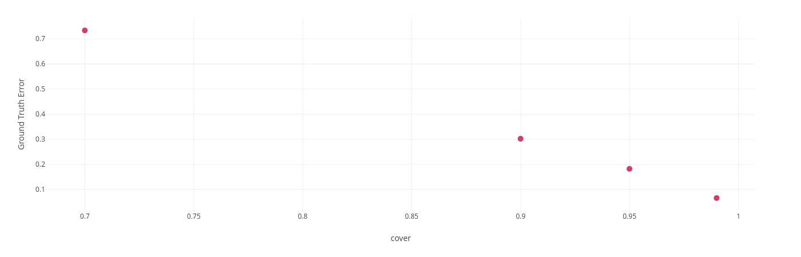

## Objective  
The purpose of this document is to present a report on the pros and cons of quantization. In place of that, I will specifically target the definition and applicability of this technique. The report is organized as follows:  
- Quantization Definition   
- Quantization arithmetic   
- Experimental Setup   
- Results and discussion    
  
## Definitions  
The idea of quantization is to project a higher-precision floating point number to a lower-precision one. The target data type can be either an integer or a floating point number. Before we delve into the specifics, let's first understand how a floating point number is represented.   
  
A float number of 32-bit precision is represented by splitting the bits into three parts: sign bit, exponent, and mantissa. The sign bit is 1 bit which indicates whether the number is positive or negative. The exponent is 8 bits that represent the power of 2 with a bias. The mantissa is the remaining 23 bits that represent the fractional part of the number. Now, let us say we want to represent the number 0.375 in 32-bit precision. First, we convert the number to binary. 
$0.375 = 2^{-2} + 2^{-3} = 0.011$ 
The next step is to normalize the number. We shift the binary point to the left until the first bit is 1. 
$0.011 = 1.1 \times 2^{-2}$ 
The sign bit is 0. The exponent is -2, but we add a bias to account for the negative exponents. The bias is 127, so the exponent is 125. The binary representation of the exponent is 01111101. The mantissa is 100000000000000000000000. Thus, the binary representation of 0.375 is:  
  
.  

Notice the number of mantissa bits represent the precision of the number, while the exponent bits are needed to represent  a wide range of numbers. Thus by reducing the number of bits in the representation, we can reduce the memory footprint of storing the number. This has a downstream effect on the computational cost of operations. As such, quantization is a technique used to reduce the memory footprint as well as the computational cost of operations. This can be utilized in deep learning models to load bigger models on smaller devices while also speeding up the computation. Now, let us see how quantization works in practice. For the purpose of this article, I will only focus on the transition from FP32 to Int8. Let us see how quantization is achieved and the corresponding arithmetic is performed.

## Quantization Arithmetic

Suppose the source set of numbers lie in the range $x \in [a, b]$ and the target set of numbers lies in the range $x_q \in [c, d]$. The linear mapping is $x = s \times (x_q - z)$. Here, $s$ is the scale factor and $z$ is the zero point. Both $x_q$ and $z$ are integers. Thus, the quantized number is $x_q = \lfloor{\cfrac{x}{s}}\rfloor + z$. Since the map is linear, the extremities of this range must map to each other. Thus, $a=s(c - z)$ and $b=s(d - z)$ which gives us the following equation
$a-b = s(c - d)$. The following expression of $s$ is derived $s = \cfrac{a-b}{c-d}$. After subsituting the value of $s$, the following expression of $z$ is derived $z = \lfloor\cfrac{ad-bc}{a-b}\rfloor$.

Now let us see how quantized matrix multiplication works. Suppose we want to perform the operation $Y = A \times B$. Here,  $Y \in \mathbb{R}^{m \times n}$, $A \in \mathbb{R}^{m \times k}$, and $B \in \mathbb{R}^{k \times n}$. Each element in $Y$ is computed as follows:  $y_{ij} = \sum_{l=1}^k a_{il} \times b_{lj}$. 
Now, we want to estimate $Y$ using quantization. We will need to quantize $A$ and $B$ first. That further requires us to compute the scale and zero factor to map the range of numbers in $A$ and $B$. With Int8 quantization, we know $a_q, b_q \in [-127, 127]$. The range of numbers covered by FP representation of $a$ and $b$ can be measured with various means. We can either estimate them using the minimum or maximum value or only considering up to a certain width of the standard deviation. Estimating the effect of this range on the accuracy of computation depends on the distribution of the underlying numbers. 

Each number in $A$ as well $B$ is a random variable and let us suppose they are IID as the other variables in the same matrix. The product of any two variables from $A$ and $B$ will also be IID. Since each number in $Y$ is the sum of such variables, they will be normally distributed for large number by Central Limit Theorem. Thus, one can argue $Y_q$ can closely estimate $Y$ if the range $[-127, 127]$ covers majority of the numbers that show up in $A$ and $B$. We will put this claim to test and study further.

Now, let us see how quantization would work. Let's replace each element in the multiplication equation by its quantized value.    
$y_{ij} = \sum_{l=1}^k s_a (a_{q, il} - z_a) \times s_b (b_{q, lj} - z_b)$    
$y_{ij} = s_a s_b \sum_{l=1}^k (a_{q, il} - z_a) \times (b_{q, lj} - z_b)$   
$y_{ij} = s_a s_b \left(\sum_{l=1}^k a_{q, il} \times b_{q, lj} - z_a \sum_{l=1}^k b_{q, lj} - z_b \sum_{l=1}^k a_{q, il} + k * z_a z_b\right)$
Now, let us substitute the expression for the $y_{ij}$ in terms of quantized values.    
$y_{q, ij} = z_y + \cfrac{s_a s_b}{s_y} \left(y_{q, ij} - z_a \sum_{l=1} b_{q, lj} - z_b \sum_{l=1} a_{q, il} + k * z_a z_b\right)$

## Forms of Quantization  
The process of quantization can be seen as that of finding a linear mapping from a larger set of discrete numbers to a smaller set. These numbers correspond to the weights or activations in some part of the model. Let us see how we can categorize quantization methods.
The first way is to categorize them based on the data type of the target number. The target number can be either an integer or a floating point number. In addition, we also consider the accumulation data type. The accumulation data type is the data type used to store the intermediate results of the computation. 
The second way to categorize quantization techniques is based on the granularity of the quantization. The granularity can be at the level of the tensor, layer, or model itself. 
The third way is to categorize based on whether the quantization is done post-training or during training. Within post-training quantization, we can further categorize based on whether the quantization is done statically or dynamically. Static quantization is when the scale factor and zero point are calculated once and used throughout the inference process. A calibration dataset is needed to estimate the appropriate quantization parameters. Dynamic quantization is when the quantization parameters are calculated on the fly. This is useful when the input data distribution changes during inference.  
Finally, during training quantization is when the quantization is done during the training process itself. The model is quantized during training so that the optimizer can adjust the weights to account for the quantization error. Next, we will  
discuss the effect of quantization on computation.  
  
## Experimental Setup  
### Matrix Multiplication  
The idea is to understand the effect of quantization on matrix multiplication. We consider FP32 as the base and Int8 as the target quantization. The accumulation data type is also kept as FP32. The matrix sizes are varied from 10 x 10, 100 x 100, 1000 x 1000, 3000 x 3000. Each matrix is sampled from a normal distribution with mean 0 and standard deviation 1 and a uniform distribution in the range $[-1, 1]$. The scale and the zero factors are computed using another parameter $cover$ that represents the fraction of numbers covered with these factors. 
 
The matrix multiplication is done using the PyTorch library. The multiplication between the quantized matrices is implemented as an outer product between each column and row of $A_q$ and $B_q$ respectively. Later, the product is dequantized. The product of the source matrices and its quantized variant are also computed as ground truth. The error is computed between 1) the source matrix product and the dequantized product of the quantized matrices, and 2) the quantized source matrix product, and product of the quantized matrices. It is estimated as the ratio of the Frobenius norm of the difference between the matrices and the Frobenius norm of the ground truth matrix.

## Results and Discussion

The first result we find is that the error rate is not affected by the size of the matrix as shown in the figure below. This makes sense since the quantized product is accumulated in an intermediate tensor of higher precision. This saves the accumulation from overflowing and as a result, the degradation is only dependent on the quality of the quantization of each value. Since the values are sampled from the same distribution, the aggregate quantization error will tend towards a normal distribution with increasing narrow range for larger matrices. For smaller matrices, we may see some variation. This effect is visible for the matrices of size 10 where the error rate is smaller or larger than for larger matrices. But beyond that the error is unaffected. 

The key result we find is that the errors are correlated with coverage. As we increase the coverage, the error reduces as shown in the figure below. This makes sense since for a smaller coverage, the number lying outside of the range will be clipped. While larger coverage can accommodate more numbers. It is important to note that the large coverage is prone to poorly resolving dense distributions. For example, covering 99.99% of numbers in a normal distribution will poorly resolve the numbers near the peak. And since numbers are densely packed there, this resolution error will affect the downstream computation as a result. In our practice, however, we did not observe this effect. 

Another effect of using coverage as the guide to compute the quantization factor is that the scale factor increases for large matrices. This result is a direct consequence of the scale factor being dependent on the range of the numbers in $Y$. Since each number is a sum of values sampled from an IID, their sum will tend to a normal distribution with a proportionally larger range. 

## Conclusion
From the above study, one can draw the conclusion that with an appropriate quantization factor, one can perform quantized arithmetic to reduce memory footprint if each value in the operand matrices is sampled from an IID. This is often the case at the beginning of training a neural network. Later, during the training, however, this may not be the case. 

